# IDTECH Secret Control Center — HashiCorp Vault Lab

## Overview

This project demonstrates a HashiCorp Vault environment for securely managing
application secrets using:

- Vault Integrated Raft Storage
- KV v2 Secrets Engine
- HCL Policies
- Token-based authentication
- Vault HTTP API
- 3-node High Availability cluster
- Raft leader election and failover

The environment was created as an isolated laboratory setup using three Linux
VMs running with Lima.

## Architecture

The Vault cluster consists of three nodes:

| Node | Hostname | API Port | Cluster Port | Raft Role |
|------|----------|----------|--------------|-----------|
| Node 1 | vault-1 | 8200 | 8201 | Follower after failover |
| Node 2 | vault-2 | 8200 | 8201 | Leader after failover |
| Node 3 | vault-3 | 8200 | 8201 | Follower |

Initial cluster state:

vault-1 → Leader  
vault-2 → Follower  
vault-3 → Follower

During the failover test, the Vault service on vault-1 was stopped.
Raft automatically elected vault-2 as the new leader.

Final cluster state:

vault-1 → Follower  
vault-2 → Leader  
vault-3 → Follower

## Network

Vault API traffic uses port `8200`.

Vault internal cluster communication uses port `8201`.

The nodes communicate through the isolated Lima laboratory network and resolve
each other using the following hostnames:

- lima-vault-1.internal
- lima-vault-2.internal
- lima-vault-3.internal

## TLS Notice

TLS is disabled in this lab configuration using:

tls_disable = 1

This configuration is used only because the environment is an isolated
laboratory network.

Disabling TLS is not appropriate for a production environment. In production,
Vault API traffic should be protected using valid TLS certificates and secure
network configuration.
## Installation and Initial Configuration

Vault `v1.21.1` was installed on all three nodes.

A dedicated system user was created for running Vault:

```bash
sudo useradd --system --home /etc/vault.d --shell /bin/false vault
Configuration and persistent Raft storage directories were created:

sudo mkdir -p /etc/vault.d
sudo mkdir -p /opt/vault/data
sudo chown -R vault:vault /etc/vault.d /opt/vault

Vault runs as a systemd service and is enabled to start automatically.

sudo systemctl enable vault
sudo systemctl start vault
sudo systemctl status vault

Each node uses Integrated Raft Storage with a unique node_id.

The complete configurations are available under the configs/ directory.

Vault Initialization and Unseal

The cluster was initialized on vault-1 using five key shares with an
unseal threshold of three:

vault operator init -key-shares=5 -key-threshold=3

Three different unseal key shares were used to unseal the node:

vault operator unseal

The same cluster unseal process was later performed for the follower nodes.

Root tokens and unseal keys are intentionally not stored in this repository
or included in screenshots.

KV v2 Secrets Engine

A dedicated KV v2 secrets engine named idtech was enabled:

vault secrets enable -path=idtech kv-v2

The following logical structure was used:

idtech/
├── dev/
│   ├── database
│   └── external-api
└── prod/
    └── database

Only fake laboratory credentials were stored.

KV v2 versioning was tested by updating the development database secret,
checking its metadata/version history, and reading a previous version.

Example commands:

vault kv metadata get idtech/dev/database
vault kv get -version=1 idtech/dev/database
vault kv get idtech/dev/database


## Access Policies

Two policies were created following the least privilege principle.

### Developer Policy

The developer policy allows:

- Read access to development secrets
- List access to development secret metadata

The developer policy does not allow:

- Writing or deleting development secrets
- Access to production secrets

The policy definition is stored in:

`policies/developer-policy.hcl`

### Administrator Policy

The administrator policy provides management access to secrets inside the
`idtech` secrets engine without granting system-level root privileges.

The policy definition is stored in:

`policies/admin-policy.hcl`

## Token and CLI Tests

Limited-TTL tokens were created for both developer and administrator policies.

The developer token was tested with the following operations:

```bash
vault kv get idtech/dev/database
```

Result: **Allowed**

```bash
vault kv get idtech/prod/database
```

Result: **Permission denied**

```bash
vault kv put idtech/dev/database \
  username="dev_user" \
  password="should_not_work"
```

Result: **Permission denied**

An administrator token was then used to update the development secret
successfully.

Tokens used during testing are not stored in this repository.
## Vault HTTP API Tests

Vault HTTP API access was tested using cURL.

The developer token was stored temporarily in the `VAULT_TOKEN` environment
variable instead of being written directly in the command.

The Vault token is passed using the `X-Vault-Token` HTTP header.

For KV v2, secret values are accessed through the `/data/` API path.

### Development Secret

```bash
curl -s \
  -H "X-Vault-Token: $VAULT_TOKEN" \
  -o /tmp/dev-response.json \
  -w "HTTP STATUS: %{http_code}\n" \
  http://127.0.0.1:8200/v1/idtech/data/dev/database
```

Result:

```text
HTTP STATUS: 200
```

This confirms that the developer policy allows access to development secrets.

### Production Secret

```bash
curl -s \
  -H "X-Vault-Token: $VAULT_TOKEN" \
  -o /tmp/prod-response.json \
  -w "HTTP STATUS: %{http_code}\n" \
  http://127.0.0.1:8200/v1/idtech/data/prod/database
```

Result:

```text
HTTP STATUS: 403
```

This confirms that the developer policy correctly denies access to production
secrets.

After the API tests, the token was removed from the shell environment:

```bash
unset VAULT_TOKEN
```
## Raft High Availability Cluster

`vault-2` and `vault-3` were joined to the existing Raft cluster through
`vault-1`.

Example join command:

```bash
vault operator raft join http://lima-vault-1.internal:8200
```

After joining, both follower nodes were unsealed using the required threshold
of three unseal key shares.

The cluster topology was verified using:

```bash
vault operator raft list-peers
```

The cluster contained exactly three voting nodes and one leader:

```text
vault-1    leader
vault-2    follower
vault-3    follower
```

A development secret was also successfully read through a follower node,
confirming that the secret remained accessible through the HA cluster.

## Failover Test

A failover test was performed by identifying the current Raft leader and
temporarily stopping its Vault service.

The initial leader was:

```text
vault-1
```

The service was stopped using:

```bash
sudo systemctl stop vault
```

After the leader became unavailable, Raft automatically elected a new leader.

The resulting topology was:

```text
vault-1    follower
vault-2    leader
vault-3    follower
```

A development secret was successfully read while `vault-1` was unavailable,
confirming that Vault remained operational after the leader failure.

The stopped node was then started again:

```bash
sudo systemctl start vault
```

Because the node was sealed after restart, it was unsealed using three valid
unseal key shares.

After recovery, the final Raft topology was:

```text
vault-1    follower
vault-2    leader
vault-3    follower
```

All three nodes were present as voting members and the cluster had exactly
one leader.

## Security Notes

- Only fake laboratory secrets were used.
- Root tokens are not stored in this repository.
- Developer and administrator tokens are not stored in this repository.
- Unseal keys are not stored in this repository.
- Sensitive authentication values are excluded from screenshots.
- TLS is disabled only for this isolated laboratory environment.
## Evidence Screenshots

The following screenshots document the Vault configuration, KV v2 tests,
policy enforcement, API access, Raft HA cluster and failover process.

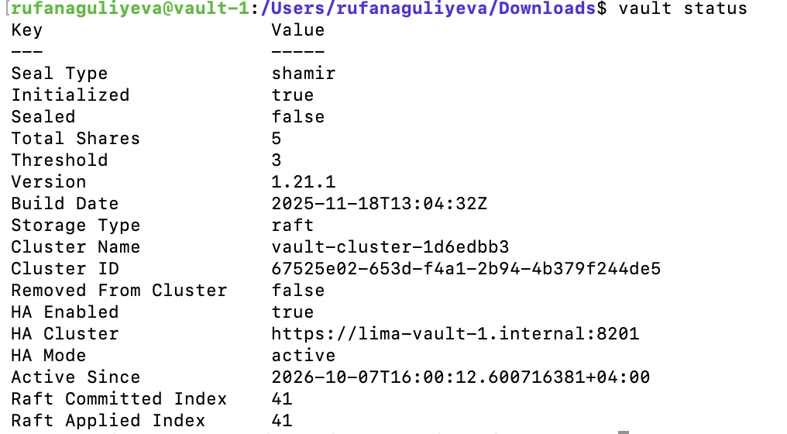
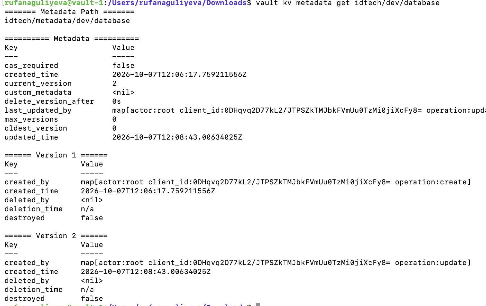
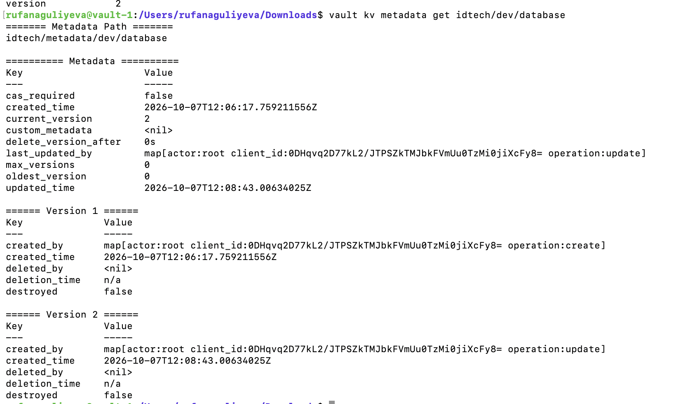
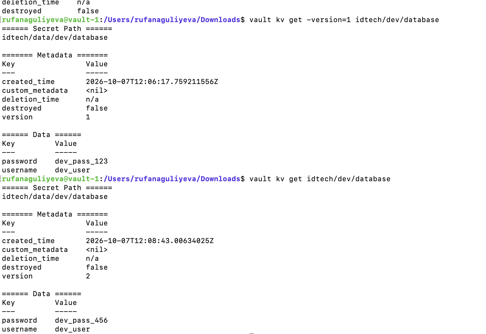
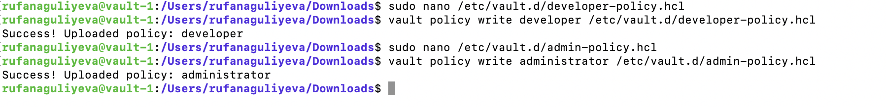
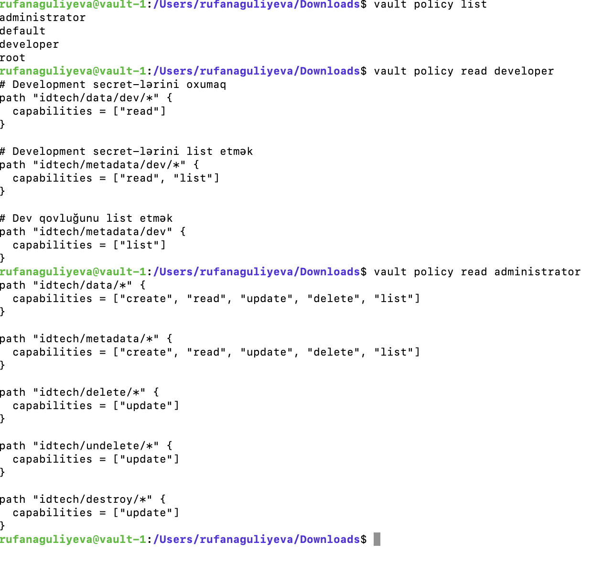
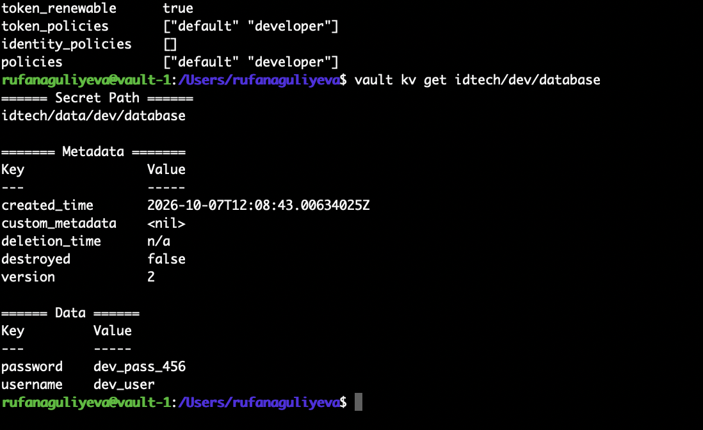
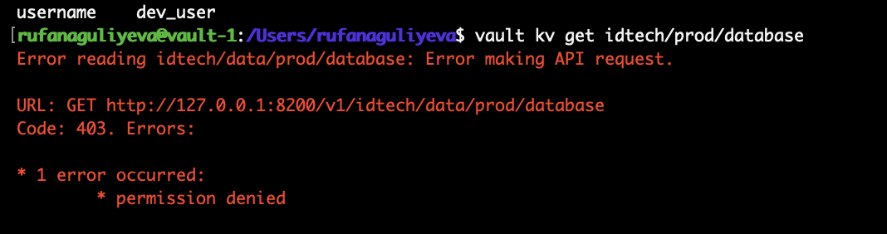
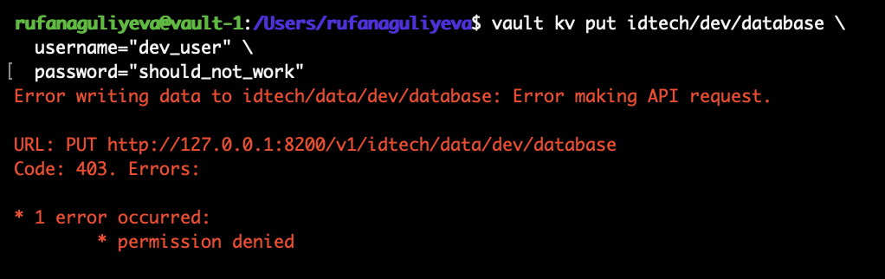
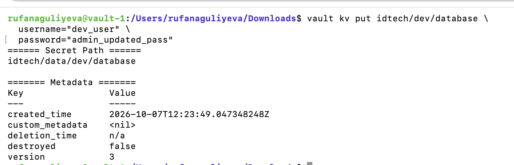
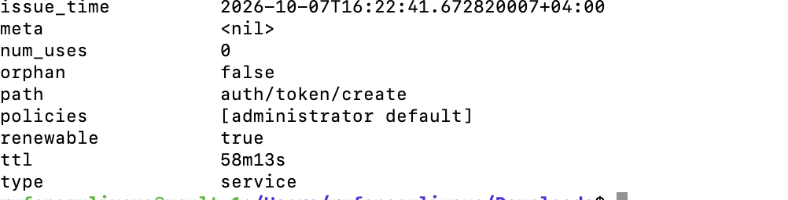
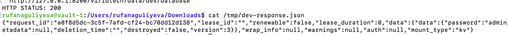
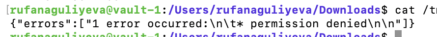
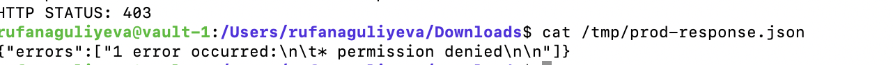
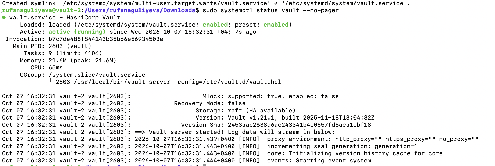
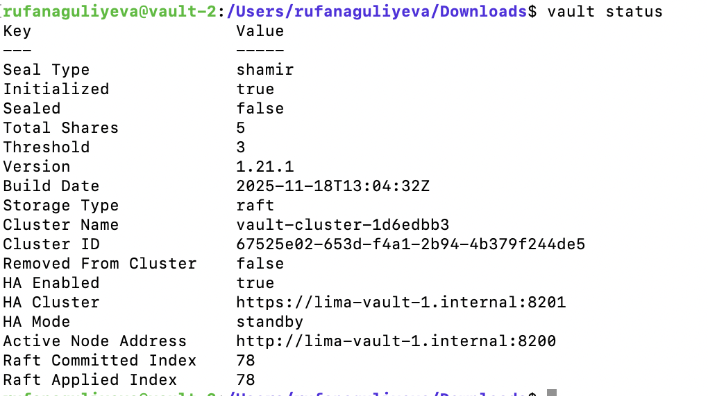
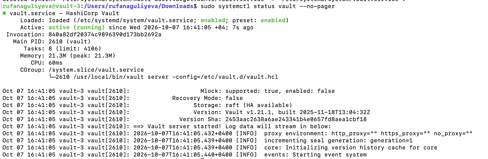
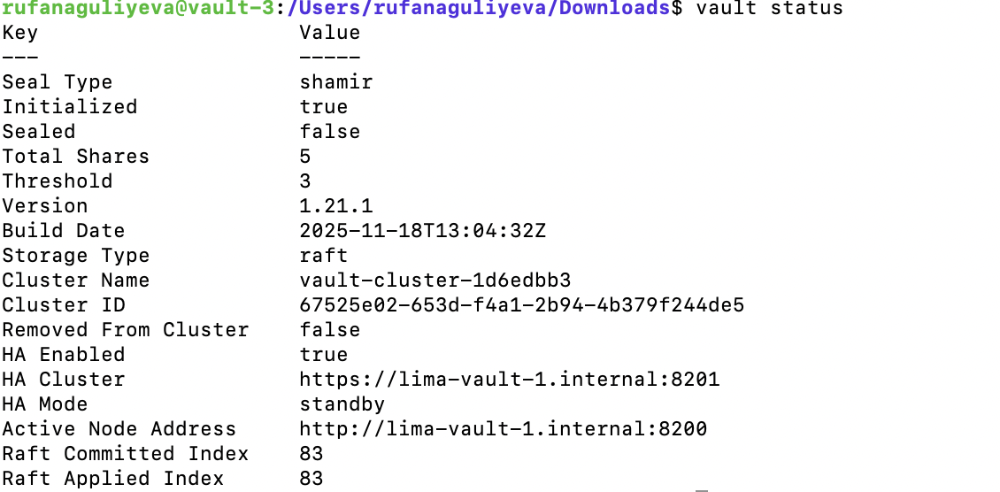
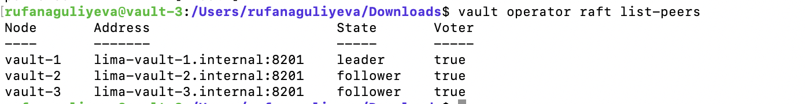
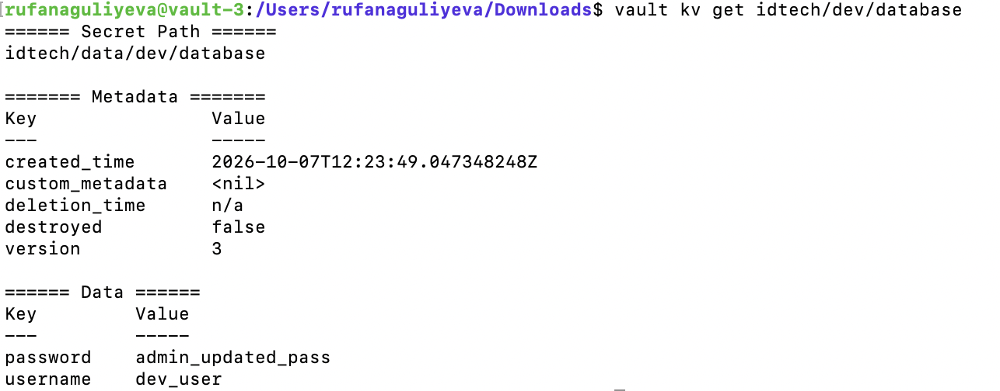
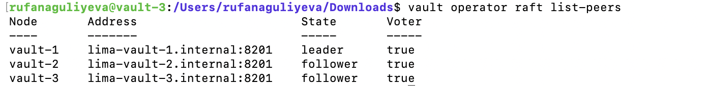
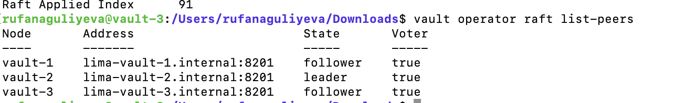
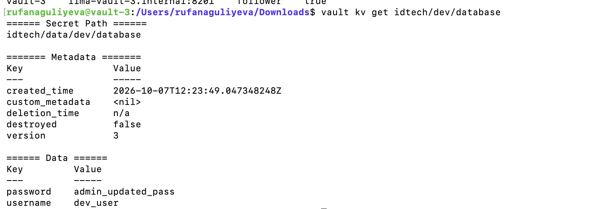
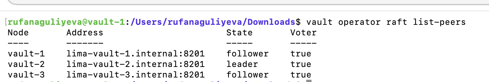
